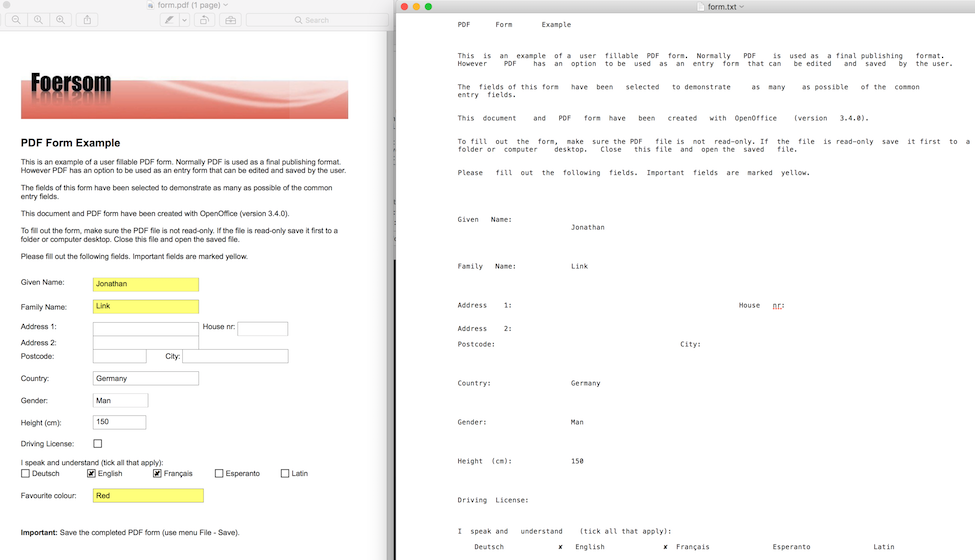

#PDFLayoutTextStripper

-
Convert a PDF file to a text file while keeping the layout. Useful to extract the content from a table or a form in a PDF file. This class is a subclass of PDFTextStripper class (from the [Apache PDFBox](https://pdfbox.apache.org/) library).

* Use cases
* How to install
* How to use

## Use cases
Data extraction from a table in a PDF file

-
Data extraction from a form in a PDF file


## How to install

1.. Install **apache pdfbox** through Maven ([to get the v1.8.13 click here](https://mvnrepository.com/artifact/org.apache.pdfbox/pdfbox/1.8.13) )

>**warning**: currently only pdfbox versions **strictly inferior to version 2.0.0** are compatible with PDFLayoutTextStripper.java

2.. Copy **PDFLayoutTextStripper.java** inside your main java package

## How to use
```
package pdftest.pt;

import java.io.FileInputStream;
import java.io.FileNotFoundException;
import java.io.IOException;

import org.apache.pdfbox.pdfparser.PDFParser;
import org.apache.pdfbox.pdmodel.PDDocument;
import org.apache.pdfbox.util.PDFTextStripper;

import ch.moneygraph.parser.PDFLayoutTextStripper;

public class test {

	public static void main(String[] args) {
		String string = null;
        try {
            PDFParser pdfParser = new PDFParser(new FileInputStream("sample.pdf"));
            pdfParser.parse();
            PDDocument pdDocument = new PDDocument(pdfParser.getDocument());
            PDFTextStripper pdfTextStripper = new PDFLayoutTextStripper();
            string = pdfTextStripper.getText(pdDocument);
        } catch (FileNotFoundException e) {
            e.printStackTrace();
        } catch (IOException e) {
            e.printStackTrace();
        };
        System.out.println(string);
	}

}
```

